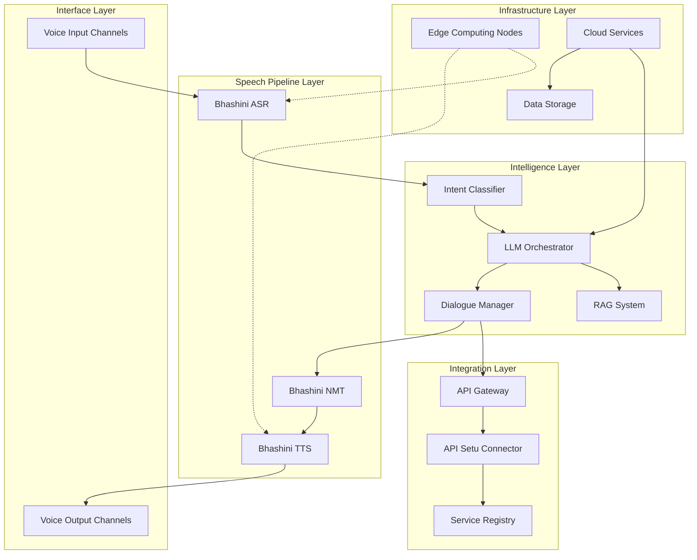
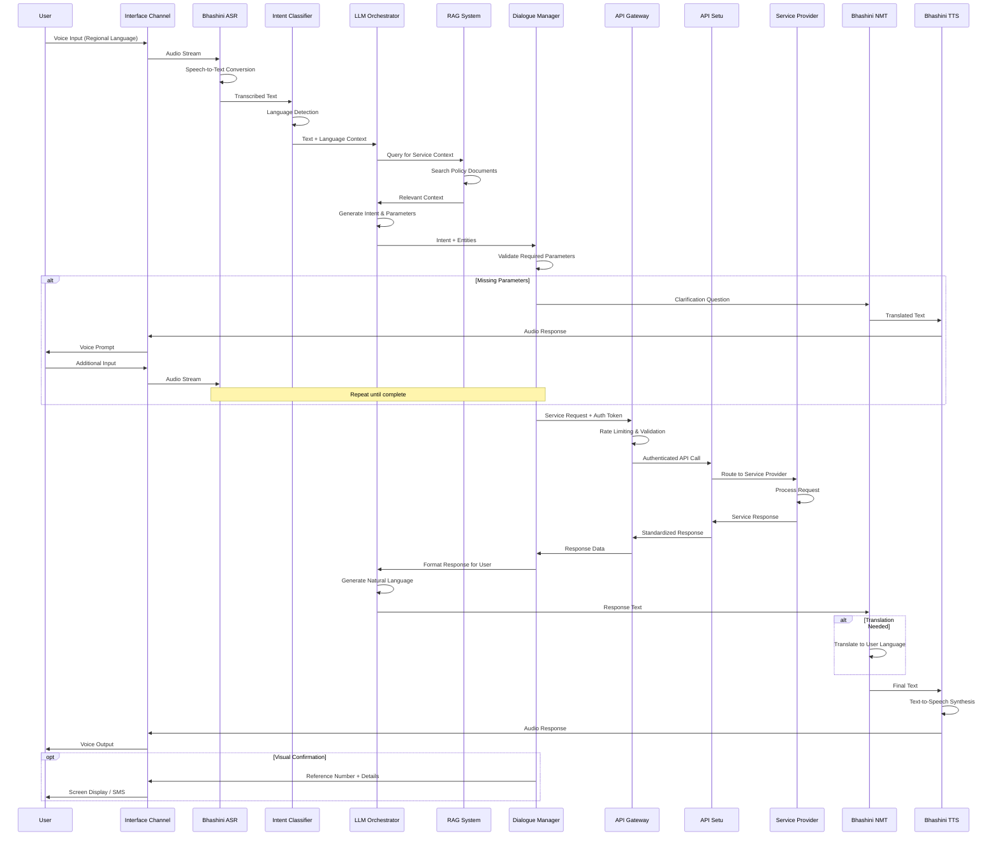

# Design Document: Vernacular AI Assistant

## Overview

The Vernacular AI Assistant is a voice-first, multilingual system designed to democratize access to Indian digital public services for low-literacy users. The system leverages Bhashini's national language infrastructure for speech processing and API Setu for government service integration. The architecture follows a cloud-native, microservices approach with edge computing capabilities to ensure low latency and high availability.

The system processes voice input in 12 Indian languages, understands user intent through a Large Language Model enhanced with Retrieval-Augmented Generation (RAG), orchestrates service requests through API Setu, and delivers natural voice responses. The design prioritizes simplicity, accessibility, and reliability to serve users with varying levels of digital literacy and network connectivity.

## Architecture

### High-Level Architecture

The system consists of five primary layers:

1. **Interface Layer**: Handles voice input/output through multiple channels (phone, mobile app, web)
2. **Speech Pipeline Layer**: Integrates Bhashini services for ASR, NMT, and TTS
3. **Intelligence Layer**: Orchestrates conversation flow using LLM with RAG capabilities
4. **Integration Layer**: Manages API Setu connections and service orchestration
5. **Infrastructure Layer**: Provides cloud-native hosting with edge computing support



### Service Request Data Flow

The following sequence diagram illustrates a complete service request flow from voice input to API response:



## Components and Interfaces

### 1. Interface Layer

**Voice Input Channels**
- **Telephony Interface**: IVR system supporting PSTN and VoIP calls
- **Mobile App Interface**: Native Android/iOS apps with voice recording
- **Web Interface**: Browser-based voice input using WebRTC
- **WhatsApp Bot**: Voice message processing through WhatsApp Business API

**Responsibilities**:
- Capture audio input from various channels
- Handle audio encoding and streaming
- Manage session initialization and termination
- Provide multi-modal output (voice + visual when available)

**Interfaces**:
```
interface VoiceInputChannel {
  startSession(userId: string, channelType: ChannelType): SessionId
  streamAudio(sessionId: SessionId, audioChunk: AudioBuffer): void
  endSession(sessionId: SessionId): void
  getSessionState(sessionId: SessionId): SessionState
}

interface VoiceOutputChannel {
  playAudio(sessionId: SessionId, audioBuffer: AudioBuffer): void
  displayText(sessionId: SessionId, text: string, language: Language): void
  sendSMS(phoneNumber: string, message: string): void
  showVisualConfirmation(sessionId: SessionId, data: ConfirmationData): void
}
```

### 2. Speech Pipeline Layer

**Bhashini ASR (Automatic Speech Recognition)**
- Converts voice input to text across 12 Indian languages
- Handles dialect variations and code-mixing
- Provides confidence scores for recognition quality
- Supports streaming and batch processing modes

**Bhashini NMT (Neural Machine Translation)**
- Translates between Indian languages and English
- Maintains context for multi-turn conversations
- Handles domain-specific terminology (government services)

**Bhashini TTS (Text-to-Speech)**
- Generates natural-sounding voice output
- Supports multiple voices per language (male/female)
- Adjustable speaking rate and prosody
- Handles numbers, dates, and special formats

**Responsibilities**:
- Interface with Bhashini API endpoints
- Manage API authentication and rate limiting
- Cache common phrases for performance
- Handle fallback when Bhashini services are unavailable
- Monitor quality metrics and error rates

**Interfaces**:
```
interface BhashiniASR {
  transcribe(audio: AudioBuffer, language?: Language): TranscriptionResult
  streamTranscribe(audioStream: AudioStream): TranscriptionStream
  detectLanguage(audio: AudioBuffer): LanguageDetectionResult
}

interface BhashiniNMT {
  translate(text: string, sourceLang: Language, targetLang: Language): TranslationResult
  translateBatch(texts: string[], sourceLang: Language, targetLang: Language): TranslationResult[]
}

interface BhashiniTTS {
  synthesize(text: string, language: Language, voice?: VoiceId): AudioBuffer
  synthesizeSSML(ssml: string, language: Language): AudioBuffer
  getAvailableVoices(language: Language): VoiceId[]
}

type TranscriptionResult = {
  text: string
  confidence: number
  language: Language
  alternatives?: string[]
}

type TranslationResult = {
  translatedText: string
  confidence: number
  detectedSourceLanguage?: Language
}
```

### 3. Intelligence Layer

**LLM Orchestrator**
- Uses BharatGen, GPT-4o, or similar large language model
- Manages conversation context and state
- Generates natural language responses
- Handles multi-turn dialogues with context retention
- Adapts language complexity for low-literacy users

**RAG System (Retrieval-Augmented Generation)**
- Vector database storing government policy documents
- Semantic search for relevant service information
- Document chunking and embedding generation
- Context injection for LLM prompts
- Maintains knowledge base of service procedures

**Intent Classifier**
- Identifies user intent from transcribed text
- Extracts entities (dates, amounts, document numbers)
- Handles ambiguous or incomplete requests
- Maps intents to available services
- Provides confidence scores for classification

**Dialogue Manager**
- Orchestrates conversation flow
- Tracks required parameters for service requests
- Generates clarification questions
- Manages error recovery and fallback strategies
- Maintains session state across turns

**Responsibilities**:
- Understand user intent regardless of phrasing
- Maintain conversation context
- Generate appropriate responses
- Validate collected information
- Handle edge cases and errors gracefully

**Interfaces**:
```
interface LLMOrchestrator {
  processInput(text: string, context: ConversationContext): OrchestratorResponse
  generateResponse(intent: Intent, data: any, context: ConversationContext): string
  simplifyLanguage(text: string, literacyLevel: LiteracyLevel): string
}

interface RAGSystem {
  query(question: string, language: Language): RetrievalResult[]
  addDocument(document: Document, metadata: DocumentMetadata): void
  updateKnowledgeBase(documents: Document[]): void
}

interface IntentClassifier {
  classify(text: string, language: Language): IntentResult
  extractEntities(text: string, intent: Intent): Entity[]
  validateIntent(intent: Intent, entities: Entity[]): ValidationResult
}

interface DialogueManager {
  processIntent(intent: IntentResult, sessionState: SessionState): DialogueAction
  generateClarification(missingParams: Parameter[]): string
  updateSessionState(sessionId: SessionId, action: DialogueAction): SessionState
  shouldEndSession(sessionState: SessionState): boolean
}

type IntentResult = {
  intent: Intent
  confidence: number
  entities: Entity[]
  alternativeIntents?: Intent[]
}

type DialogueAction = 
  | { type: 'CLARIFY', parameters: Parameter[] }
  | { type: 'EXECUTE_SERVICE', serviceRequest: ServiceRequest }
  | { type: 'RESPOND', message: string }
  | { type: 'END_SESSION', summary: string }

type ConversationContext = {
  sessionId: SessionId
  userId: string
  language: Language
  conversationHistory: Turn[]
  collectedEntities: Entity[]
  currentIntent?: Intent
}
```

### 4. Integration Layer

**API Gateway**
- Central entry point for all service requests
- Handles authentication and authorization
- Implements rate limiting and throttling
- Provides request/response transformation
- Logs all API interactions for audit

**API Setu Connector**
- Manages OAuth2 authentication with API Setu
- Discovers available services dynamically
- Handles service-specific request formatting
- Implements retry logic with exponential backoff
- Transforms API responses to conversational format

**Service Registry**
- Maintains catalog of available government services
- Stores service metadata (parameters, authentication requirements)
- Provides service discovery capabilities
- Tracks service health and availability
- Manages service versioning

**Responsibilities**:
- Secure communication with government services
- Handle API failures gracefully
- Transform technical responses to user-friendly language
- Maintain service availability information
- Ensure compliance with government API policies

**Interfaces**:
```
interface APIGateway {
  authenticate(credentials: Credentials): AuthToken
  executeRequest(request: ServiceRequest, authToken: AuthToken): ServiceResponse
  checkRateLimit(userId: string, service: ServiceId): RateLimitStatus
  logRequest(request: ServiceRequest, response: ServiceResponse): void
}

interface APISetuConnector {
  discoverServices(): ServiceCatalog
  callService(serviceId: ServiceId, parameters: ServiceParameters, authToken: AuthToken): APIResponse
  getServiceMetadata(serviceId: ServiceId): ServiceMetadata
  handleError(error: APIError): ErrorResponse
}

interface ServiceRegistry {
  registerService(service: ServiceDefinition): void
  getService(serviceId: ServiceId): ServiceDefinition
  searchServices(query: string): ServiceDefinition[]
  checkServiceHealth(serviceId: ServiceId): HealthStatus
  listAvailableServices(userContext: UserContext): ServiceDefinition[]
}

type ServiceRequest = {
  serviceId: ServiceId
  parameters: ServiceParameters
  userId: string
  sessionId: SessionId
  language: Language
}

type ServiceResponse = {
  success: boolean
  data?: any
  error?: ErrorResponse
  referenceNumber?: string
  nextSteps?: string[]
}

type ServiceDefinition = {
  serviceId: ServiceId
  name: string
  description: string
  provider: ServiceProvider
  requiredParameters: Parameter[]
  authenticationMethod: AuthMethod
  endpoint: string
  rateLimit: RateLimitConfig
}
```

### 5. Infrastructure Layer

**Edge Computing Nodes**
- Deployed in multiple Indian regions for low latency
- Handle ASR and TTS processing close to users
- Cache frequently accessed data
- Provide offline capability for basic functions
- Reduce bandwidth costs for voice processing

**Cloud Services**
- Primary hosting on AWS/Azure/GCP
- Kubernetes for container orchestration
- Auto-scaling based on load
- Multi-region deployment for high availability
- Managed services for databases and message queues

**Data Storage**
- **Session Store**: Redis for active session state
- **User Data**: PostgreSQL for user profiles and preferences
- **Conversation Logs**: Time-series database for analytics
- **Knowledge Base**: Vector database (Pinecone/Weaviate) for RAG
- **Cache Layer**: CDN for static content and common responses

**Responsibilities**:
- Ensure high availability (99% uptime)
- Provide low latency (<3 seconds response time)
- Scale automatically based on demand
- Maintain data security and privacy
- Support disaster recovery

**Infrastructure Components**:
```
Cloud Architecture:
- Load Balancer (Application Load Balancer)
- API Gateway (Kong/AWS API Gateway)
- Container Orchestration (Kubernetes/EKS)
- Message Queue (RabbitMQ/AWS SQS)
- Cache (Redis Cluster)
- Database (PostgreSQL with read replicas)
- Vector Database (Pinecone/Weaviate)
- Object Storage (S3/Azure Blob)
- Monitoring (Prometheus + Grafana)
- Logging (ELK Stack)

Edge Nodes:
- Regional edge servers in major Indian cities
- ASR/TTS processing containers
- Local cache for common phrases
- Fallback to cloud when needed
```

## Data Models

### Session Model
```
Session {
  sessionId: string (UUID)
  userId: string
  channelType: ChannelType (PHONE | MOBILE_APP | WEB | WHATSAPP)
  language: Language
  startTime: timestamp
  lastActivityTime: timestamp
  status: SessionStatus (ACTIVE | IDLE | ENDED)
  conversationHistory: Turn[]
  collectedEntities: Entity[]
  currentIntent?: Intent
  metadata: {
    deviceInfo?: string
    location?: string
    networkQuality?: string
  }
}

Turn {
  turnId: string
  timestamp: timestamp
  userInput: {
    audio?: AudioReference
    transcription: string
    confidence: number
  }
  systemResponse: {
    text: string
    audio?: AudioReference
    visualData?: any
  }
  intent?: Intent
  entities: Entity[]
}
```

### User Model
```
User {
  userId: string (UUID)
  phoneNumber?: string (encrypted)
  preferredLanguage: Language
  literacyLevel: LiteracyLevel (LOW | MEDIUM | HIGH)
  voiceBiometricId?: string
  preferences: {
    speakingRate: number (0.5 - 2.0)
    voiceGender: VoiceGender (MALE | FEMALE)
    enableVisualConfirmation: boolean
    enableSMSSummary: boolean
  }
  serviceHistory: ServiceInteraction[]
  createdAt: timestamp
  lastActiveAt: timestamp
}

ServiceInteraction {
  interactionId: string
  serviceId: ServiceId
  timestamp: timestamp
  status: InteractionStatus (SUCCESS | FAILED | PENDING)
  referenceNumber?: string
  satisfactionRating?: number (1-5)
}
```

### Intent Model
```
Intent {
  intentId: string
  intentName: string (e.g., "CHECK_RATION_CARD_STATUS")
  category: ServiceCategory
  requiredEntities: EntityDefinition[]
  optionalEntities: EntityDefinition[]
  serviceMapping: ServiceId
  examplePhrases: {
    [language: Language]: string[]
  }
}

Entity {
  entityType: EntityType (DATE | AMOUNT | DOCUMENT_NUMBER | NAME | LOCATION)
  value: any
  confidence: number
  rawText: string
  normalized: any
}

EntityDefinition {
  name: string
  type: EntityType
  required: boolean
  validationRules: ValidationRule[]
  promptTemplate: {
    [language: Language]: string
  }
}
```

### Service Model
```
ServiceDefinition {
  serviceId: string
  serviceName: {
    [language: Language]: string
  }
  description: {
    [language: Language]: string
  }
  provider: ServiceProvider
  category: ServiceCategory
  endpoint: string
  authMethod: AuthMethod (OAUTH2 | API_KEY | CERTIFICATE)
  parameters: ParameterDefinition[]
  responseSchema: JSONSchema
  rateLimit: {
    requestsPerMinute: number
    requestsPerDay: number
  }
  availability: {
    schedule: string (cron expression)
    maintenanceWindows: TimeWindow[]
  }
}

ParameterDefinition {
  name: string
  type: DataType
  required: boolean
  validation: ValidationRule[]
  description: {
    [language: Language]: string
  }
  example: any
}
```

### Knowledge Base Model
```
Document {
  documentId: string
  title: {
    [language: Language]: string
  }
  content: {
    [language: Language]: string
  }
  category: DocumentCategory
  serviceIds: ServiceId[]
  embedding: number[] (vector)
  metadata: {
    source: string
    lastUpdated: timestamp
    authorityLevel: number
    keywords: string[]
  }
  chunks: DocumentChunk[]
}

DocumentChunk {
  chunkId: string
  text: string
  embedding: number[]
  startPosition: number
  endPosition: number
}
```

## Correctness Properties

*A property is a characteristic or behavior that should hold true across all valid executions of a system—essentially, a formal statement about what the system should do. Properties serve as the bridge between human-readable specifications and machine-verifiable correctness guarantees.*


### Property 1: Multi-language Audio Processing
*For any* supported Indian language (Hindi, English, Tamil, Telugu, Bengali, Marathi, Gujarati, Kannada, Malayalam, Punjabi, Odia, Assamese), when a user provides voice input in that language, the system should capture and process the audio for speech recognition.
**Validates: Requirements 1.1, 2.1**

### Property 2: Audio Quality Filtering
*For any* audio input with detectable background noise, the system should apply filtering before processing to improve recognition accuracy.
**Validates: Requirements 1.3**

### Property 3: Poor Quality Audio Handling
*For any* audio input with quality below the processing threshold, the system should prompt the user to repeat their request rather than attempting to process it.
**Validates: Requirements 1.4**

### Property 4: Response Time Performance
*For any* user input under normal network conditions, the system should extract user intent and generate a response within 3 seconds.
**Validates: Requirements 1.5, 10.1**

### Property 5: Automatic Language Detection
*For any* new session with voice input, the system should automatically detect the spoken language and use it for the entire session unless explicitly changed by the user.
**Validates: Requirements 2.2, 2.4**

### Property 6: Language Confidence Threshold
*For any* language detection with confidence below 80%, the system should ask the user to confirm their preferred language before proceeding.
**Validates: Requirements 2.3**

### Property 7: Bhashini Integration Consistency
*For any* speech-to-text, text-to-speech, or translation operation, the system should use Bhashini APIs exclusively across all supported languages.
**Validates: Requirements 2.5, 3.1, 11.1, 11.2**

### Property 8: Long Response Segmentation
*For any* response containing complex information or exceeding 30 seconds of audio, the system should break it into digestible segments with pauses and offer to repeat or summarize.
**Validates: Requirements 3.3, 3.4**

### Property 9: User Preference Adherence
*For any* audio output generation, the system should apply the user's configured preferences for volume and speaking speed.
**Validates: Requirements 3.5**

### Property 10: Service Provider Routing
*For any* service request, the system should correctly identify and route to the appropriate service provider through API Setu based on the user's intent.
**Validates: Requirements 4.1**

### Property 11: Authentication Before Service Access
*For any* service request requiring user data, the system should authenticate the user via voice biometrics or OTP before accessing the service.
**Validates: Requirements 4.3**

### Property 12: Required Parameter Collection
*For any* service that requires user information, the system should collect all required parameters through conversational prompts before submitting the request.
**Validates: Requirements 4.4**

### Property 13: Service Confirmation with Reference
*For any* successfully completed service request, the system should provide voice confirmation that includes a reference number.
**Validates: Requirements 4.5**

### Property 14: Intent Variation Handling
*For any* intent, the system should correctly recognize it regardless of phrasing variations, dialects, or colloquial expressions used by the user.
**Validates: Requirements 5.2**

### Property 15: Ambiguity Clarification
*For any* ambiguous user input where intent cannot be determined with high confidence, the system should ask clarifying questions before proceeding.
**Validates: Requirements 5.3**

### Property 16: Conversation Context Retention
*For any* multi-turn conversation within a session, the system should maintain context from previous turns and not require users to repeat previously provided information.
**Validates: Requirements 5.4, 6.5**

### Property 17: Topic Switch Recognition
*For any* conversation where the user changes topics mid-session, the system should recognize the context switch and adapt its responses accordingly.
**Validates: Requirements 5.5**

### Property 18: Option Presentation Limit
*For any* response that presents choices to the user, the system should present no more than 3 options at a time to avoid cognitive overload.
**Validates: Requirements 6.2**

### Property 19: Multi-Step Process Guidance
*For any* multi-step process, the system should provide step-by-step guidance with confirmation requested at each step before proceeding.
**Validates: Requirements 6.3**

### Property 20: Se